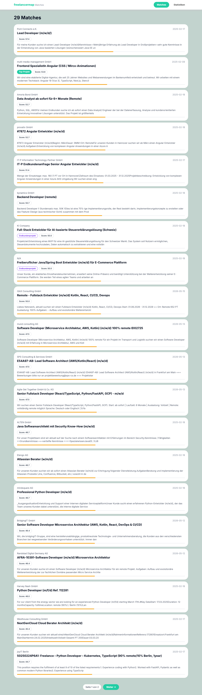
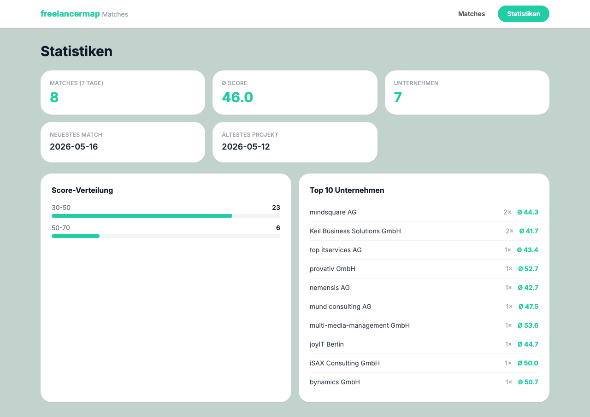

# Freelancermap Match Crawler `v2.0.0`

Scrapt Projekte von [freelancermap.de](https://www.freelancermap.de), matched sie gegen dein Skill-Profil und zeigt die Ergebnisse in einem Web-Interface an.

## Screenshots




---

## Features

- Scraping der Projektbörse via AJAX-API
- Matching gegen ein konfigurierbares Skill-Profil mit Score (0–100)
- SQLite-Datenbank zur Speicherung aller Projekte und Matches
- Web-Interface (Flask) mit Matches, Detailansicht und Statistiken
- Desktop-UI (tkinter) zum Starten des Scrapers ohne Terminal
- CSV-Export der Matches

## Scoring

| Kategorie | Max. Punkte |
|---|---|
| Keyword-Matches (exakt) | 30 |
| Keyword-Matches (partiell) | 20 |
| Skills in Beschreibung | 20 |
| Bevorzugte Keywords in Beschreibung | 10 |
| Aktualität (exponentieller Verfall, 15 Tage) | 20 |

Projekte mit ausgeschlossenen Keywords erhalten automatisch Score 0.

---

## Installation

### Voraussetzungen

- Python 3.10+
- Homebrew (macOS) für tkinter: `brew install python-tk@3.XX`

### Setup

```bash
# Repository klonen
git clone ...
cd freelancermap

# Virtuelle Umgebung erstellen & aktivieren
python3 -m venv venv
source venv/bin/activate

# Abhängigkeiten installieren
pip install -r requirements.txt
```

### Zugangsdaten

`.env` Datei im Projektordner anlegen:

```env
FREELANCERMAP_USERNAME=deine@email.de
FREELANCERMAP_PASSWORD=deinPasswort
```

---

## Verwendung

### Scraper (Terminal)

```bash
python3 projectMatcher.py
```

Zugangsdaten und Einstellungen können direkt im Tab **Konfiguration** eingetragen werden.

### Web-Interface

```bash
python3 webserver.py
# → http://localhost:5000
```

### Datenbank-Browser

```bash
python3 -m sqlite_web freelancermap.db
# → http://localhost:8080
```

---

## Konfiguration

Das Skill-Profil wird in `projectMatcher.py` oder über die Desktop-UI gepflegt:

```python
profile = {
    'skills': ['Python', 'JavaScript', 'React', 'Vue', 'AWS', ...],
    'preferred_keywords': ['Backend', 'Frontend', 'Fullstack', ...],
    'excluded_keywords': ['SAP', 'Drupal'],
}
```

---

## Projektstruktur

```
freelancermap/
├── projectMatcher.py   # Scraper + Matching-Logik
├── webserver.py        # Flask Web-Interface
├── ui.py               # tkinter Desktop-UI
├── templates/          # HTML-Templates (Tailwind)
├── docs/               # Screenshots
├── requirements.txt
└── .env                # Zugangsdaten (nicht im Git)
```

---

## Lizenz

MIT
